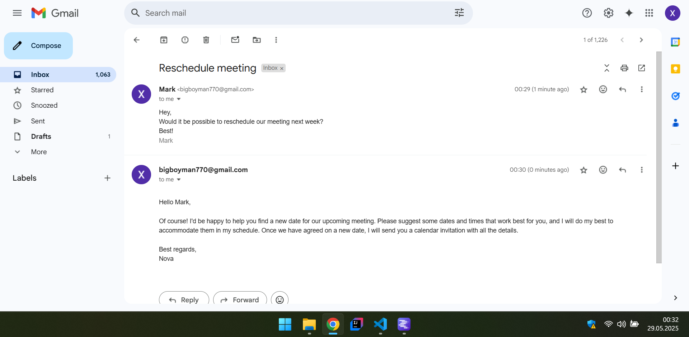

# AI Email Responder

An automated email assistant that reads unread emails from a Gmail account, generates polite and professional replies using a locally hosted AI language model (Mistral 7B Instruct via LM Studio), and sends replies back through Gmail.

---

## Features

- Connects to Gmail API to fetch unread emails, including sender info and email metadata  
- Uses LM Studio with the Mistral 7B Instruct model running locally to generate AI-powered email replies  
- Sends email responses via Gmail API
- Modular Python codebase for easy extension and customization  

---

## Tools & Technologies

- **Python**  
- **Gmail API**  
- **Google OAuth 2.0**  
- **LM Studio**  
- **Mistral 7B Instruct model**  

---

## Screenshot

